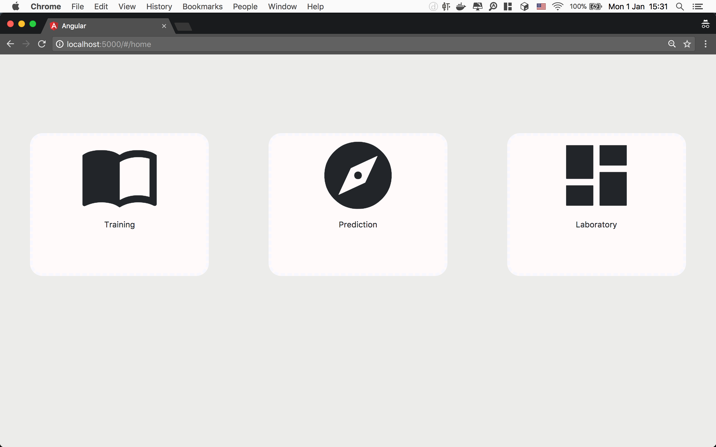
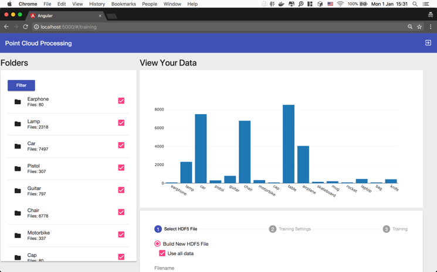
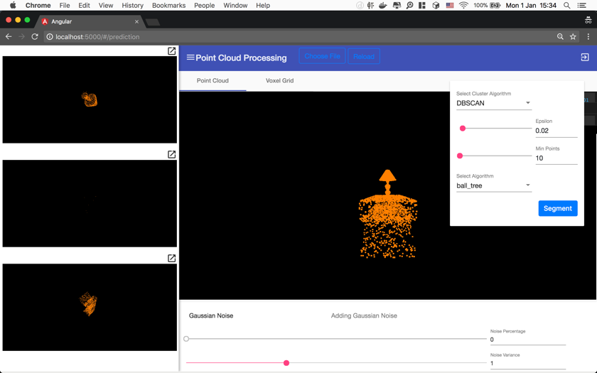
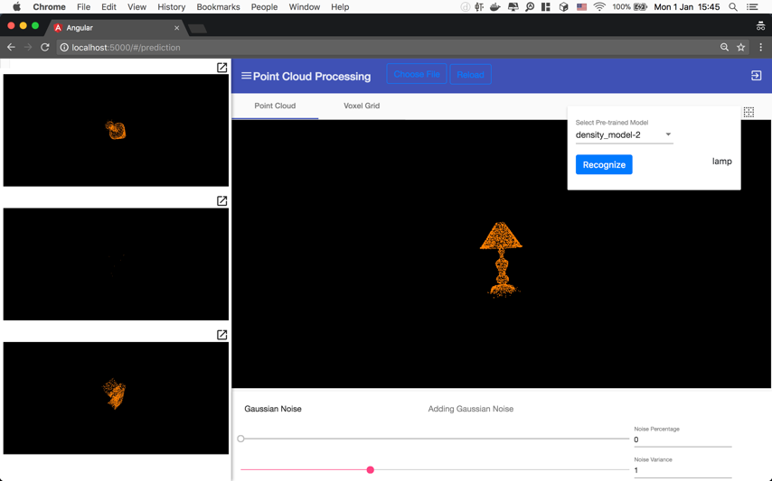
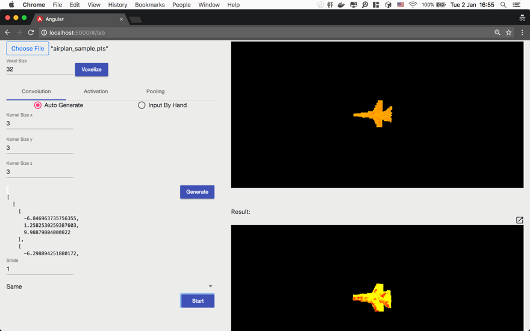

# 3D-CNN

Point cloud data classification built with Tensorflow.

This project contains two parts which is concept and application respectively. While the concept contains all the trail python scripts along with many Jupyter Notebooks, the application is built with Angular and Python Flask.

## Web app for CNN model

### Requirements
- node
- python 3
- Training data. Sample training data can be found [here](http://web.stanford.edu/~ericyi/project_page/part_annotation/index.html).

### Dependencies
#### Running with Jupyter Notebook only.
- [Anaconda Python 3](https://www.anaconda.com/download/)
- [PyntCloud](http://pyntcloud.readthedocs.io/en/latest/installation.html) (Unlicensed)
- [tensorflow](https://www.tensorflow.org/)

#### Additional packages for starting the app.
- npm
- @angular/cli
- [flask](http://flask.pocoo.org)

#### Dependencies For Running on GPU
Tensorflow-GPU version requires Nvidia GPU which supports CUDA. You can find the list of valid GPUs [here](https://developer.nvidia.com/cuda-gpus).
- [tensorflow-gpu](https://www.tensorflow.org/)
- [CUDA](https://developer.nvidia.com/cuda-zone)

After Installation, you can try running [this script](https://gist.github.com/mrry/ee5dbcfdd045fa48a27d56664411d41c) to verify you got all dependencies on your <b>Windows machine</b>. You may find it under '/tools/tensorflow-self-check.py'.

### Usage
- Home Page

- Training 

- Segmentation

- Prediction 

- Layer Extraction 

#### How to run
##### For running the app:
Before running:
~~~
$ cd ./app/angular
$ npm install
~~~

For running:
~~~
$ bash run.bash
~~~

For cleaning up:
~~~
$ bash clean.bash
~~~

##### For running the concept:
~~~
$ cd ./concept
$ jupyter notebook
~~~
